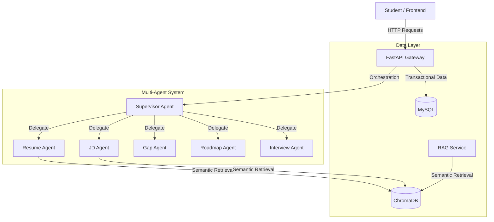

# AI Career Copilot - System Design Document

This document details the system design, architecture, database schemas, and multi-agent workflow for the **AI Career Copilot** application. 

---

## 1. System Architecture

The AI Career Copilot is structured as an agent-driven web application. A user interacts with the React frontend, which communicates with a FastAPI backend. The backend orchestrates multi-agent tasks using LangGraph and handles unstructured knowledge retrieval using a Vector DB (ChromaDB) and transactional data storing in a relational database (MySQL).



---

## 2. Directory Structure

The project layout separates concerns cleanly between the backend (Python API & Agents) and frontend (React application):

```text
AI-Career-Copilot
│
├── backend/
│   ├── app/
│   │   ├── agents/      # LangGraph state definitions & agents (Resume, JD, Gap, Roadmap, etc.)
│   │   ├── api/         # FastAPI router, schemas, & endpoints
│   │   ├── services/    # Business logic (PDF extraction, parsing, analytics)
│   │   ├── rag/         # Embeddings, chunking, retrieval, & ChromaDB connector
│   │   ├── models/      # SQLAlchemy database models
│   │   └── utils/       # Configuration, logging, & helper functions
│   ├── tests/           # Unit and integration test suites
│   ├── requirements.txt # Python package dependencies
│   └── main.py          # FastAPI application entry point
│
├── frontend/
│   ├── public/
│   └── src/
│       ├── components/  # Reusable UI elements (Buttons, Uploaders, Dialogs)
│       ├── hooks/       # Custom React hooks
│       ├── pages/       # High-level layouts (Dashboard, Interview, Roadmap)
│       ├── services/    # API integration layer
│       ├── App.jsx
│       └── index.css    # Core design system & layout styles
│
├── database/            # Database scripts, migrations, and seeding files
├── docs/                # Design documentation & user manuals
├── prompts/             # System prompts and instruction files for LLM agents
└── assets/              # Images, icons, and static assets
```

---

## 3. Database Design

### Structured Transactional Data (MySQL)
Relational databases are optimized for ACID-compliant transactions, foreign key constraints, and relational queries.

#### Table 1: `users`
Tracks user credentials and profile details.
* `id` (INT, Primary Key, Auto Increment)
* `name` (VARCHAR(100))
* `email` (VARCHAR(100), Unique, Indexed)
* `created_at` (TIMESTAMP, Default Current)

#### Table 2: `resumes`
Stores the raw extracted text of uploaded resumes mapping back to the user.
* `id` (INT, Primary Key, Auto Increment)
* `user_id` (INT, Foreign Key referencing `users(id)`)
* `filename` (VARCHAR(255))
* `resume_text` (LONGTEXT)
* `uploaded_at` (TIMESTAMP, Default Current)

#### Table 3: `job_descriptions`
Stores the job description details.
* `id` (INT, Primary Key, Auto Increment)
* `user_id` (INT, Foreign Key referencing `users(id)`)
* `title` (VARCHAR(255))
* `description_text` (LONGTEXT)
* `uploaded_at` (TIMESTAMP, Default Current)

#### Table 4: `analyses`
Maintains records of resume/JD match evaluations.
* `id` (INT, Primary Key, Auto Increment)
* `user_id` (INT, Foreign Key referencing `users(id)`)
* `resume_id` (INT, Foreign Key referencing `resumes(id)`)
* `jd_id` (INT, Foreign Key referencing `job_descriptions(id)`)
* `match_score` (INT)
* `missing_skills` (JSON)  -- E.g., `["LangGraph", "ChromaDB"]`
* `recommendations` (TEXT)
* `created_at` (TIMESTAMP, Default Current)

#### Table 5: `interview_sessions`
Tracks the history and performance scores of mock interviews.
* `id` (INT, Primary Key, Auto Increment)
* `user_id` (INT, Foreign Key referencing `users(id)`)
* `questions` (JSON)       -- E.g., `[{"id": 1, "text": "..."}]`
* `answers` (JSON)         -- E.g., `[{"question_id": 1, "text": "..."}]`
* `scores` (JSON)          -- E.g., `{"overall": 85, "details": "..."}`
* `created_at` (TIMESTAMP, Default Current)

---

## 4. Vector Database Design (ChromaDB)

Unstructured textual data requires semantic retrieval capabilities rather than exact-match database queries. We use ChromaDB to store vector embeddings.

### Collection Layout
1. **Resume Chunks**: Used to query details about a candidate's projects or experience contextually.
2. **Job Description Chunks**: Used to query role requirements.
3. **Knowledge Base Chunks**: Stores student materials (DSA notes, system design notes, cloud documentation) to provide domain-specific context for mock interviews and study roadmaps.

#### Metadata Schema example:
```json
{
  "chunk_id": "kb_dsa_001",
  "document_type": "knowledge_base",
  "source": "dsa_notes.pdf",
  "content": "A hash map uses a hash function to compute an index into an array of buckets...",
  "embedding": [0.012, -0.453, 0.812, "..."]
}
```

---

## 5. Multi-Agent Workflow & LangGraph Execution

When a user triggers an analysis, a stateful multi-agent system runs.

```text
User Request
    │
    ▼
[Supervisor Agent] (Decides execution plan)
    │
    ├─► [Resume Agent] ------► Extract skills, projects, experience.
    │
    ├─► [JD Agent] ----------► Extract required & preferred skills.
    │
    ├─► [Gap Agent] ---------► Compare resume vs JD, calculate match score.
    │
    └─► [Roadmap Agent] -----► Construct weekly learning plans.
```

### Communication & State Schema
The system maintains a shared graph state:
```python
class AgentState(TypedDict):
    resume_text: str
    jd_text: str
    resume_skills: List[str]
    jd_required_skills: List[str]
    match_score: int
    missing_skills: List[str]
    roadmap_plan: Dict[str, Any]
    next_step: str
```

---

## 6. Key Interview Questions & Answers

### Q: Why did you opt for a Multi-Agent architecture instead of a single long prompt?
> A single monolithic prompt is fragile and suffers from "lost in the middle" phenomena, where the LLM misses details from long inputs. It is also hard to debug, evaluate, and scale. By building specialized agents (Resume, JD, Gap, Roadmap), I separated responsibilities. Each agent has a focused system prompt, output schema validation, and unique tooling. This enables unit testing for individual agents and isolated updates to prompts without regression in other parts of the system.

### Q: Why not store embeddings directly in MySQL? Why have both MySQL and ChromaDB?
> Relational databases (MySQL) are highly efficient for structured transactions, referential integrity, and exact lookups (like querying user profiles, tracking session logs, and checking billing). However, vector search requires specialized index types like HNSW (Hierarchical Navigable Small World) to perform cosine-similarity queries at scale. Storing embeddings in MySQL (using extensions like pgvector for Postgres or raw columns for MySQL) adds unnecessary load and lacks native agent integrations. Separating transactional data (MySQL) and semantic indices (ChromaDB) creates clean infrastructure boundaries and optimizes each database for its primary workload.

### Q: How does Retrieval-Augmented Generation (RAG) fit into this career mentorship tool?
> Standard LLMs are frozen in time and have general internet knowledge. A career copilot should answer questions grounded in the user's specific reference guides, university course slides, or interview notes. By implementing a RAG pipeline, we chunk and embed local documents (like DSA or System Design notes) and save them to ChromaDB. When a student asks "Explain LangGraph using my notes", we retrieve the top relevant chunks, inject them into the LLM context, and construct a precise, personalized explanation.
